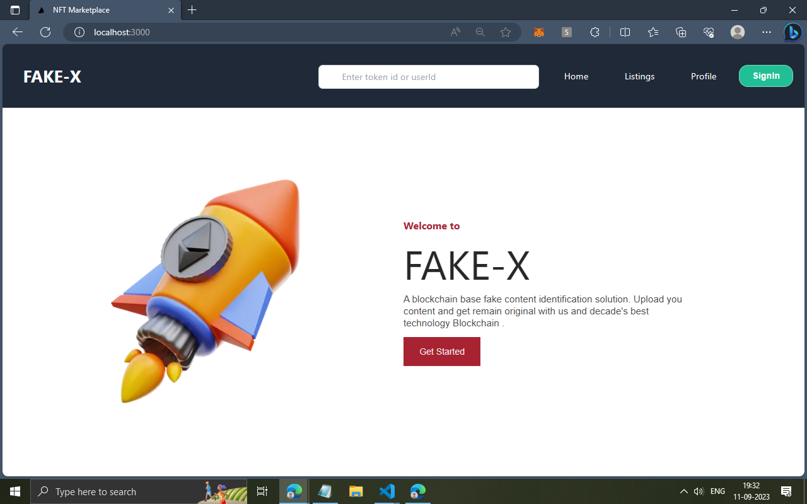
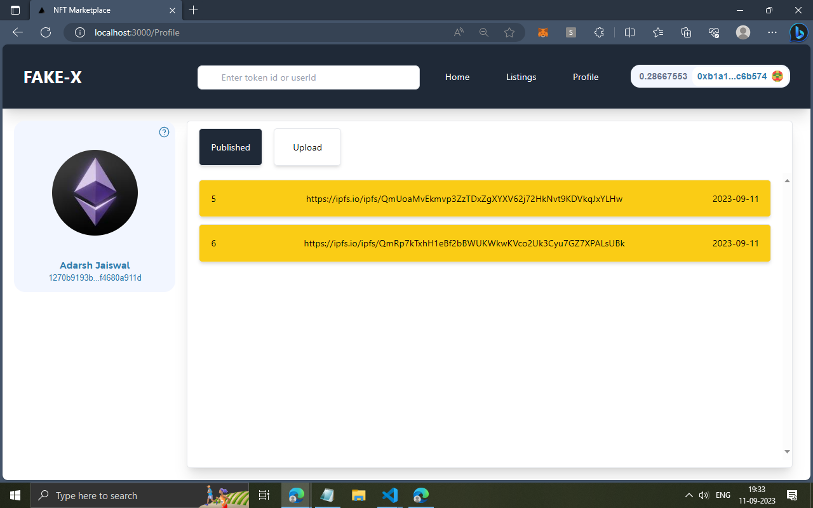
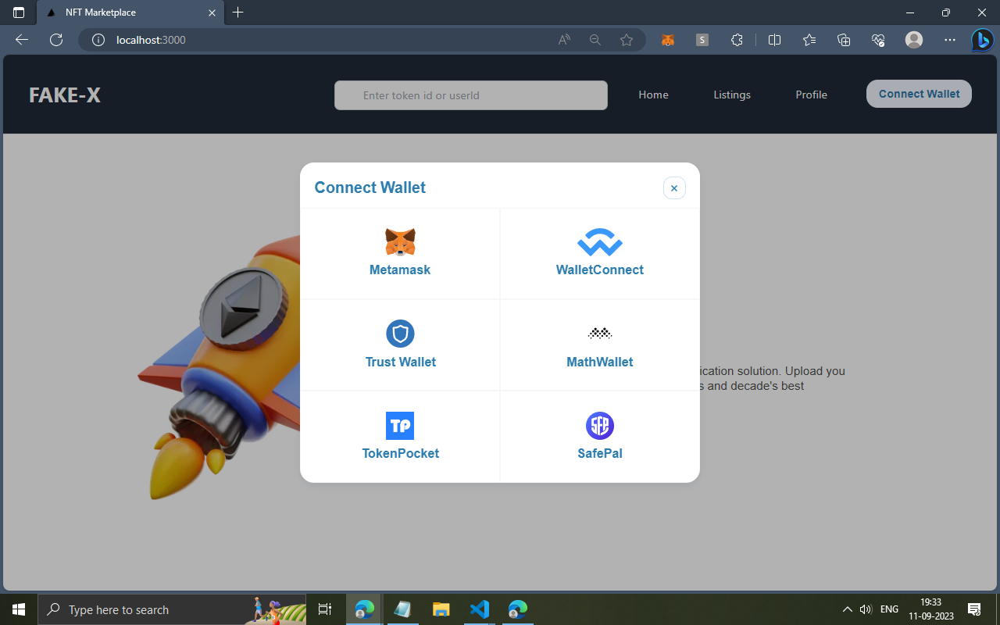
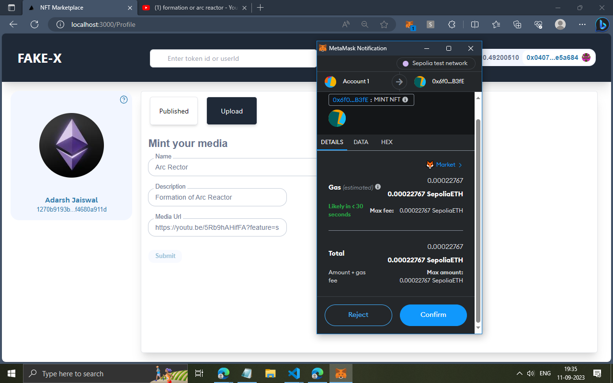
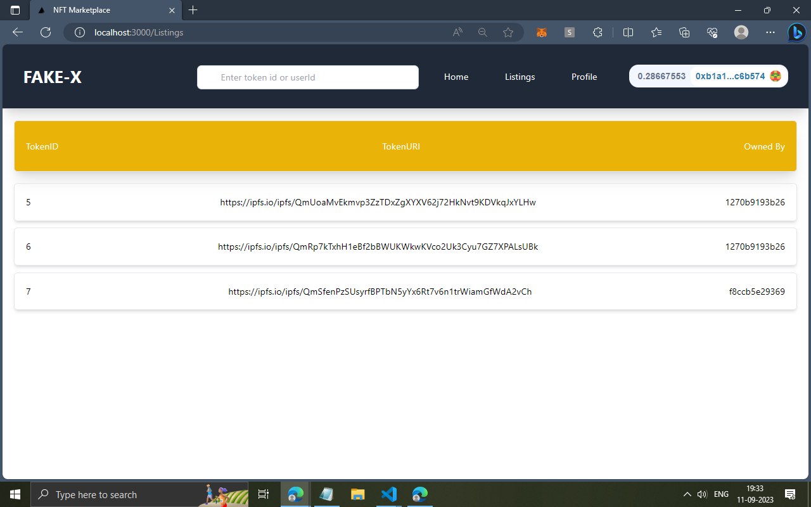
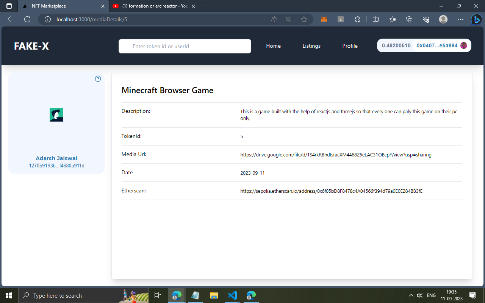
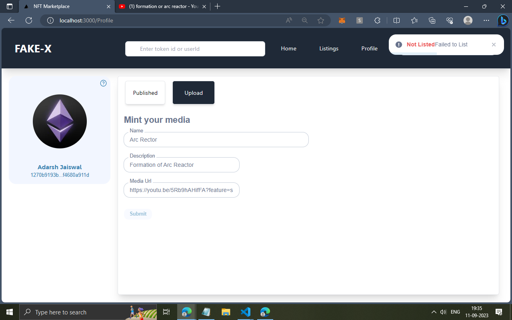

# Fake-X-Blockchain-based-fake-content-identifier
This blockchain based project solves the problem of fake content generated by ai . As it gives unique tokenId to every content and attach it with verified user which can be attached to every type of content so the user can come to this website to check weather that content is uploaded by original user.

## Working
* It takes some details of the your content such as name , description and link of content
* Then it generates a json file containg all the data
* After that it add the link for json file into blockchain network ( ethereum )
* Then it returns a tokenId to user which user can share accross platform
* After view get the token then verify it on **FAKE-X** that this belongs to whome

## Technologies
  * Solidity
  * Moralis
  * Firebase
  * Nextjs
  * Web3uikit
  * expressjs
  * pinata
  * nodejs
  * cryptojs

## Screenshots

